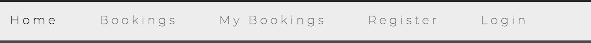
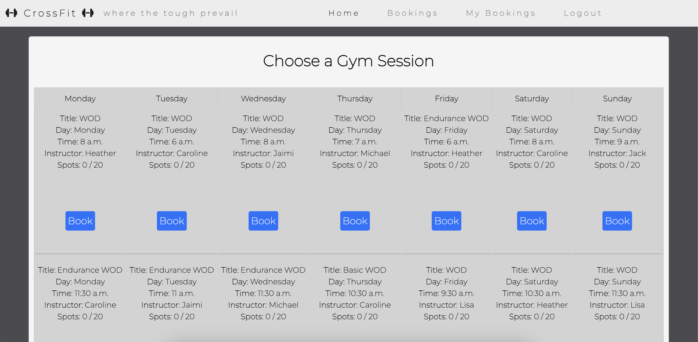
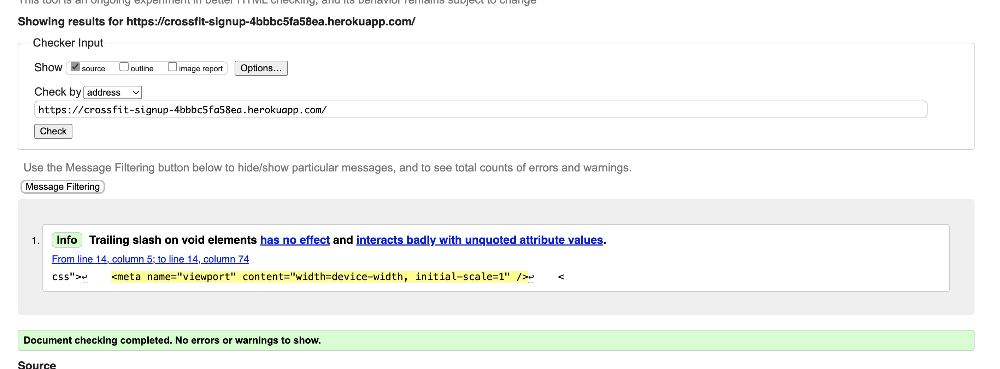
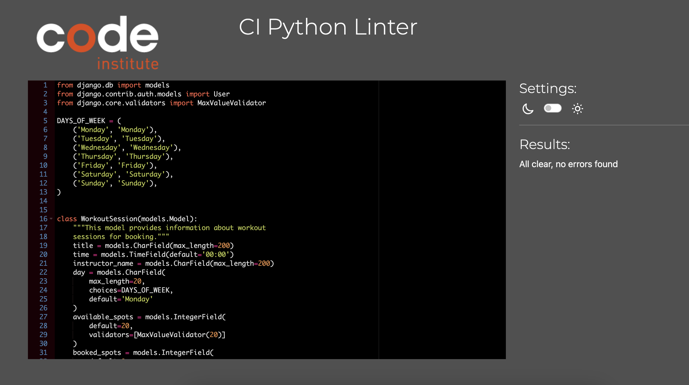
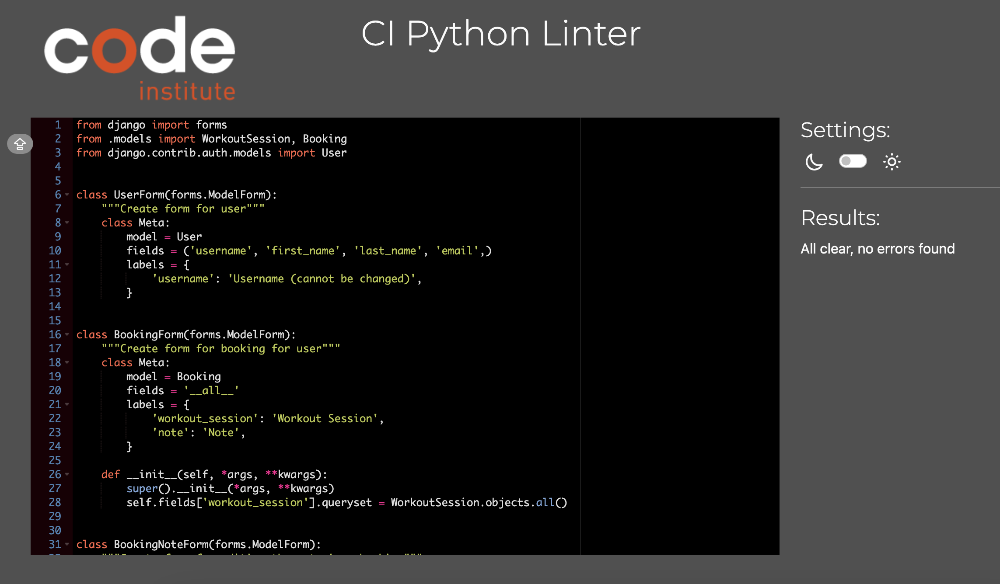

# PROJECT PORTFOLIO FOUR - CROSSFIT BOOKING SYSTEM

The deployed app [Heroku](https://crossfit-signup-4bbbc5fa58ea.herokuapp.com/) 

[Github Repository](https://github.com/Jaimilit/CrossFit-Signup) 

# Table of Contents

- [Project Goals](#project-goals)
- [UX](#ux)
    - [Agile Tools](#Agile-Tools)
- [Design and Structure](#design-and-structure)
    - [Kanban Boards](#kanban-boards)
    - [Functional Structure](#functional-structure)
- [WireFrames](#Wireframes)
- [Features](#features)
    - [Navigation Bar](#navigation-bar)
    - [Pages](#pages)
- [Responsive Design](#responsive-design)
- [Future Features](#future-features)
- [Technology Used](#technology-used)
    - [Languages](#languages)
    - [Frameworks, Libraries, and Programs](#frameworks-libraries-and-programs)
    - [Database](#database)
    - [Program and Tools](#program-and-tools)
- [Testing](#testing)
    - [Bugs](#bugs)
        - [Manual Testing](#manual-testing)
        - [Browser Testing](#browser-testing)
    - [Validation](#validation)
        - [HTML Validation](#html-validation)
        - [CSS Validation](#css-validation)
        - [Python Validation](#python-validation)
        - [Lighthouse](#lighthouse)
- [Deployment](#deployment)
    - [Github](#github)
    - [Heroku](#heroku)
- [Credits](#credits)
    - [Code](#code)
    - [Content](#content)
    - [Media](#media)
    - [Inspiration](#inspiration)

# PROJECT GOALS
This is the fourth project under the Code Institute Diploma in Software Development Program. This website is for a fictional gym called "CrossFit - where the tough prevail." It is designed to be a website where members of this gym can sign up for CrossFit workout classes like a real gym. It is kept basic because it is meant to be a place where users view and book their gym classes.

# UX

User stories

As a first time visitor, I want:

* To easily understand the main purpose of the site
* To be able to easily navigate through the site
* To be able to register a user account to access all content without restrictions
* To be able to reserve a day and time for a class, view my bookings, and delete my bookings
* To be able to log out of my user account

Returning and frequent user goals

As a returning user, I want:

* To sign into my user account
* To make a booking for a class on a certain day and time
* To view my bookings
* To delete my bookings
* To sign out of my account

Site Administrator goals

* As a Site Administrator I would like to be able to create the workout sessions which users can book
* As a Site Administrator I also can view bookings and deletions

## Agile Tools

The Projects section in GitHub was used for this project. A Kanban board was used for the development of this project, which made it possible to break down the project into subtasks and make it easier to complete and track project progress.  In addition, labels were used to further define the priority of each user story in the Kanban board.

# Design and Structure

The layout and design of this site was kept basic and simple. Minimal color was used to keep it simple. [Coolors](https://coolors.co/) was used for simple color choices. Users are booking workout sessions and; therefore, this website is meant to be functional.  

Buttons were styled to standout with hover actions to provide user feedback. All delete buttons were styled in red as a widely accepted color to direct user caution. And this is in contrast to the blue buttons.

## Kanban Boards

[Kanban Board](https://github.com/users/Jaimilit/projects/4) was used to create this project.
User Stories were moved through the process from To do >> In Progress >> Done on the Kanban Board.
All User Stories were prioritized: Must Have, Should Have, & Would Like to Have. 

Here you can see my overview of my kanban board and moving items around as I was working on them.

Here is an example and this one has the "should have" option to it.

## Functional Structure
Home page: The home page contains a navigation menu, logo, and an image that gives the user an idea of what the website is about. Here users are given basic information about the class scheduled offered, and a brief explanation of the different sessions that are offered - WOD, Endurance, & Basic. Each section also has an icon for it. There is an image in the background of this section which is kept dark, as not to take away from the important information given. The background image is of a girl completing a box jump, something that they will expect to do in their classes.

Registration page: The user must create an account to make a booking. To do this, they are asked to fill out a form on the page with the required fields: username and password. There is also an optional email field.

Login page: A username and password are required to log in for existing users. Once signed in, they are directed to the home page.

Logout page: Logging out of the account is done through the menu, after which the user is redirected to the logout page where they must confirm their desire to log out of the account. After a successful logout, the user is returned to the home page.

Bookings page: The page is only available to authenticated users and displays the classes/sessions offered. It is displayed in a calendar format and each day offers four workout sessions/classes to choose from. For each sessions a title of the workout is given, as well as the day, time, and instructor. A user cannot access this page unless they are registered and logged in.

My Bookings page: Only authenticated users have access to this page. On this page displays all the user's bookings. It provides the user with information for each session booked: title, day, time, & instructor. There's an option to delete each booking. When clicked, the user is brought to a new page in which the user needs to confirm if they want to delete the booking or can choose to return to My Bookings page. After deleting, the user is returned to the My Bookings page. The user is informed if they have no bookings too.

# Wireframes

Wireframes were used to create the basic layout of the project. The wireframes pages can be seen below:

Homepage:

Booking Page:

Booking Successful/Delete Booking/Booking Already Made:

Models for creating bookings:

# FEATURES

## Navigation Bar

The navigation bar is present on all pages of the site. The nav bar as different sections: Home, Bookings, My Bookings, Registration and Login/Logout. Also, the navigation bar is an adaptive element, and on mobile screens it collapses into a hamburger icon.

Navigation for an unauthorized user:

Navigation for an authorized user - registration disappears:

## Pages

Registration Page - Where a user can sign up to use the platform:

Sign-In Page - Where a returning user can log-in:

Log Out Page - Where a user can log out. It asks for confirmation to log out: 

Bookings Page - Where an authenicated user can view the bookings and choose a session to book: 

My Bookings Page - Where an authenticated user can view all their bookings:

Booking Successful - Where a user is informed that their booking was successful:

Booking Aleady Made Page - Where a user is informed if they previously made their chosen booking: 

Delete Booking Page - Where a user can delete a booking:

No Bookings - Where a user is informed if they currently have no bookings:

Footer - Information that it was created by me plus appropriate links:

Main Admin Page - Main Admin page to create workouts and view bookings made:

Admin Workout - Where Admin created the workout sessions to be booked by users:

Admin Bookings - Where Admin can view the bookings made and deleted:

# Responsive Design

The site has been designed to be responsive and adapted for use on both desktop and mobile devices. The project has been tested using a multi-device emulator with different screen sizes in the Google Chrome Developer Dashboard.

# Future Features

* Page with information about the instructors
* Ability to have 10 attendee max for each session and inform the user that the session is full
* Create a user profile which the user can view 

# Technology Used:

## Languages:

* Python
* JavaScript
* HTML5
* CSS3

## Frameworks, Libraries, and Programs:

* [Django](https://pypi.org/project/Django/3.2.14/): Python framework used to create all the backend
* [Bootstrap](https://getbootstrap.com/): Frontend framework used to provide structure, style, and responsive behaviour

## Database:
* [PostgreSQL](https://www.elephantsql.com/): The database used to store all the data 

## Programs and Tools:

* [Google Fonts](https://fonts.google.com/): Was used to to incorporate font styles
* [Font Awesome](https://fontawesome.com/): Was used to create the icons used on the website
* [Gitpod](https://gitpod.io/workspaces): Gitpod was used as IDE to commit and push the project to GitHub, though I started with Codeanywhere, but most of it was in Gitpod
* [GitHub](https://github.com/): Was used to store my code
* [Am I Responsive](https://ui.dev/amiresponsive): To generate an image showcasing the website's responsiveness to different screen sizes
* [Pip3](https://pypi.org/project/pip/): To install Python modules and libraries
* [Gunicorn](https://docs.djangoproject.com/en/4.1/howto/deployment/wsgi/gunicorn/): "Green Unicorn" is a Python Web Server Gateway to translate HTTP Requests for Python to understand
* [Spycopg2](https://pypi.org/project/psycopg2/): PostgreSQL database adapter so I can manage the Database in Python
* [Cloudinary](https://cloudinary.com/): The image hosting service used to upload images and other media
* [Heroku](https://dashboard.heroku.com/apps): The hosting service used to host the website
* [VSCode](https://code.visualstudio.com/): The IDE used to develop the website
* [Chrome Developer Tools](https://developer.chrome.com/docs/devtools/open/): Was used to debug the website
* [W3C Validator](https://validator.w3.org/): Was used to validate HTML5 code for the website
* [W3C CSS validator](https://jigsaw.w3.org/css-validator/): Was used to validate CSS code for the website
* [Github Projects](https://github.com/): Kanban board was used to track the progress of the project in general and of every application in the project
* [Wireframes](https://balsamiq.com/learn/articles/what-are-wireframes/): Was used to created the outline for my project

# Testing

## Bugs

###
No known bugs remaining

### Manual Testing

Testing was done throughout the process while developing the project by the use of Django debug pages and printing statements to check that the code functioned accordingly. In addition, thorough testing has been performed and is described below, it contains manual test to check that all user stories and acceptance criteria are met, as well as testing and validating the code with different online tools as presented below.

### Browser Testing

Testing has been carried out on the following browsers:

* Google Chrome
* Firefox
* Safari

The site was constantly tested during the process of creating the site in the Gitpod Environment and the deployed site on Heroku was also tested in terms of user experience. The available functionality and user experience is reflected in the table below.

| Goals and Actions | As a Guest | As a User | Comment |
| -------- | -------- |  -------- | -------- |
| I can use the menu and navigate through the pages   | X | X | Click on items
| I can see the Home Page   | X | X | Click on items
| I can see the Registration Page  | X | X | Click on items and this disappears from the nav bar once registered
| I can see the Bookings Page |   | X | Need to be authorized to see
| I can see the My Bookings page  |  | X | Need to be authorized to see
| I can see the Sign Up Page | X | X | Click on items
| I can see the Login/Logout Pages | X | X | You see one or the other depending on if you are logged in or logged out
| I can complete the Registration form  | X | X | Click on items
| I can complete the Sign In form  | X | X | Click on items
| I can make a booking for a particular session/class |  | X | Need to be authorized to do
| I can delete a particular session/class |   | X | Need to be authorized to do
| I can see if I have made a booking successfully  |   | X | Need to be authorized to do
| I can see if I have already made a booking for a session  |  | X | Need to be authorized to do

* Example of format error was not putting the different days in the right place. It was putting all the workouts under Monday which was the default. This was later recified.

* Example of format issue for the layout of the success page.

* Example of issues with functions between booking and booking_session not working correctly. Automated testing to fix issue.

| Bug| Solution | Fixed 
| -------- | -------- |  
|  Issue with bookings showing all on Mondays | Need to adjust the book_session and booking functions |
| Issue with filtering objects if booking_exists to be able to later change the booking  | Use print states and True/False to find the error |
| CSS issues on Successful Booking Page | Ensure all classes were correct, as well as divs | 
| Delete Booking wouldn't go to delete_booking page | Needed to rework delete function and return renders outcomes | 
| When Debug was set to False, none of the CSS was displayed in Heroku app| Python command to collect static files | 

## Validation

### HTML Validation:
The W3C Markup Validation Service was used to validate the HTML of the website. There were errors and warnings in the reports about unclosed elements and tags, incorrect values ​​and types of elements, and unnecessary trailing slashes. All errors and warnings have been fixed, the project's HTML code has been re-checked without significant errors.

It shows one error here and I have fixed it, but it still shows.

### CSS Validation:
The website CSS style has successfully passed the W3C Jigsaw CSS Validation Service.

### Python Validation (PEP8)
All Python code was manually checked using CI Python Linter. The Linter reports had messages about exceeding the string length of 79 characters, which have been fixed. Re-testing did not reveal any errors.

* urls.py

* models.py

* forms.py

* views.py

During testing a few issues were identified and corrected:

* Extra whitespace was deleted
* Indentations were corrected
* Two lines spaces between functions and classes
* All lines adjusted to <80 characters
* Minor errors with missing closing tags

### Lighthouse

# Deployment
I followed the below steps using the Code Institute tutorial. The project was first created in GitHub, then using the workspace in CodeAnywhere, and then in Gitpod again for most of the project. The project code is stored on GitHub, and then deployed to Heroku. To deploy, follow these steps:

## Github

1. Create an account at GitHub or login to an existing account.
2. Go to the GitHub repository for CrossFit-Signup.
3. Click the 'Code' button and copy and paste code into Codeanywhere workspace or Gitpod workspace.
4. A copy of the repository will be available in your own workspace.

## Heroku
The site is deployed to Heroku through the following steps:

1. Log in to Heroku or create an account, if required. On the Welcome page in the top right corner click the button labeled 'New'.
2. From the drop-down menu select 'Create new app'. Enter a preferred app name. Select the relevant geographical region. Click to 'Create App'.
3. Navigate to 'Settings' and scroll down to the 'Config Vars' section. Click 'Reveal Config Vars' and enter 'PORT' for the key and '8000' for the value. Then click 'Add'. Add CLOUDINARY_URL, DATABASE_URL and SECRET_KEY. URL variable values ​​must be copied from your [CLOUDINARY](https://cloudinary.com/) account and [ElephantSQL](https://www.elephantsql.com/) account. To create a SECRET KEY, use the online service or come up with your own.
4. Click on the 'Deploy' tab. Next to 'Deployment method' select 'GitHub'. Connect the relevant GitHub repository. Under 'Manual deploy' choose the correct branch and click 'Deploy Branch'. Also you can select 'Automatic Deploys' so that the site updates when updates are pushed to GitHub.
5. After successful deployment message in the page top right corner click the button labeled 'Open app' and you can access live app.

# Credits

## Code
The structure and the code of the project was based on two walkthroughs by the Code Institute:

* Hello Django - I created CRUD functionalities based on the examples of this walkthrough.
[Django Documenation](https://www.djangoproject.com/) was used to provide examples of code solutions and Django functionality.
* [Bootstrap Documenation](https://getbootstrap.com/)  was used to provide examples of Bootstrap functionality and building blocks.
* [Code Institute WalkThroughs](https://codeinstitute.net/se/) "Hello Django" and "I Think Therefore I Blog" worked as inspiration and code examples.

## Content

Information is fictional and created by me and I was inspired by my own CrossFit box 
[CrossFit Fabriken](https://www.cf-fabriken.com/). This is my CrossFit box and my inspiration for this project. Though this information is in Swedish. They use an app called [Wondr](https://wondr.cc/en-gb/home) in which members book their own CrossFit sessions for the week.

## Media

The one image was free to use from [Pexels](https://www.pexels.com/).

## Inspiration

* This project was inspired by the "Hello Django" and the "I Think Therefore I Blog" projects from Code Institute.
 * Larisa LG's Readme.md file was used as a template for writing my own Readme.md.
 * CrossFit Fabriken website and Wondr App were used as inspiration for my app.
